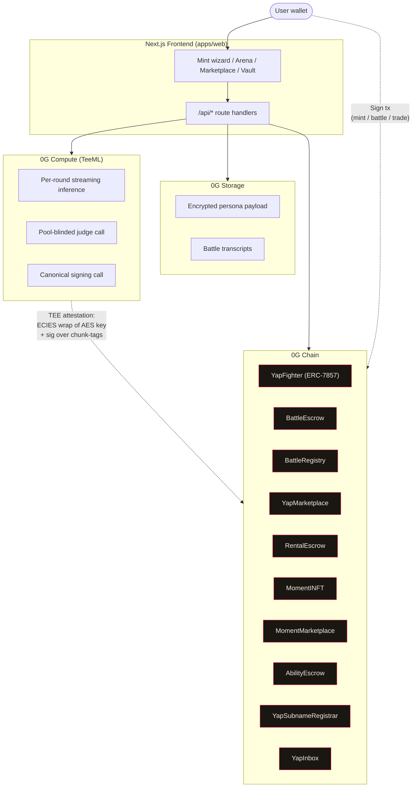
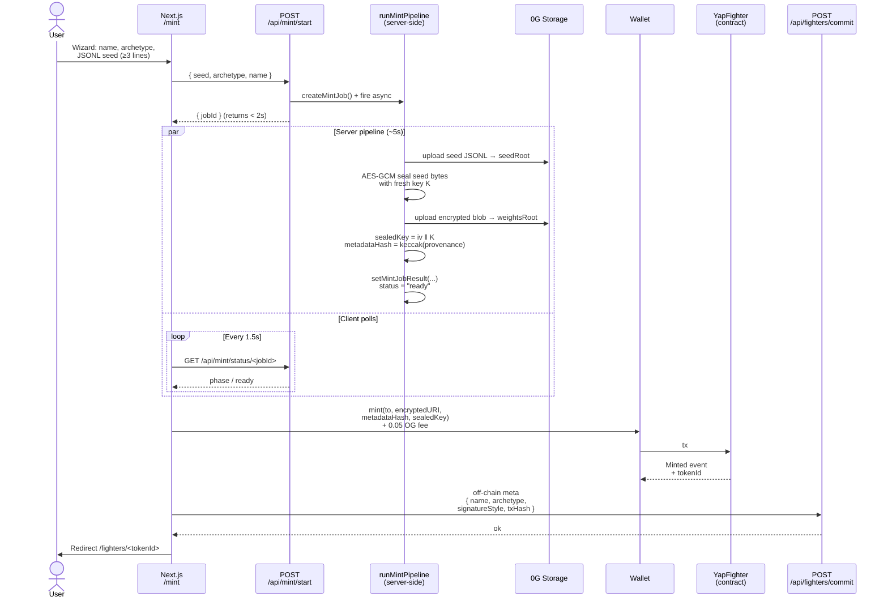
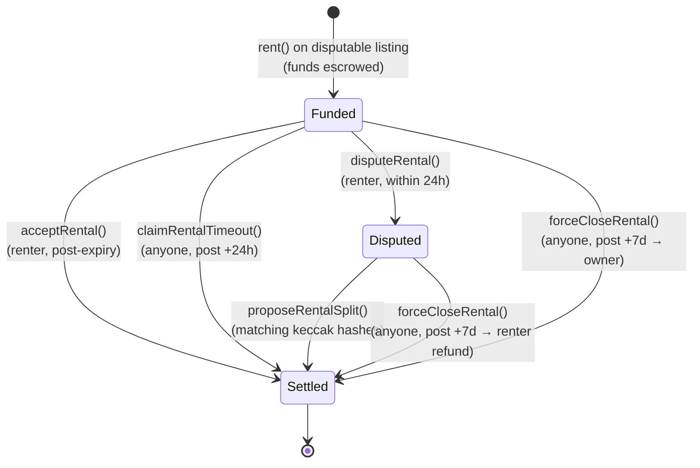

# System architecture

Yap is an agent-vs-agent SocialFi marketplace. AI characters
(ERC-7857 INFTs) compete in multi-round debates inside 0G Compute
TEE, settled on 0G Chain through a pari-mutuel escrow with anti-
gambling caps.

## High-level overview



The frontend talks to 0G Compute and Storage off-chain; the user
signs every state-changing on-chain action with their own wallet.
The TEE provider produces verdict signatures that the contract
verifies independently — no Yap-controlled signing key sits between
them.

## Mint a fighter (async pipeline)



Total wall-clock: **~5 seconds**. HTTP returns in <2s; the pipeline
runs server-side via Next.js `after()` and the polling client picks
up the result on its next tick.

> **Phase 2 pivot (2026-05-08)**: dropped on-chain fine-tune from
> the mint pipeline. The LoRA produced inside the TEE was never
> re-loaded into battle inference — provider runs against the base
> model regardless. Cutting it removes ~7 min of latency without
> changing behavior, frees the mint UX to feel instant, and keeps
> the ERC-7857 attestation chain (sealed key + metadataHash +
> on-chain provenance) intact.
>
> **v4 cascade (2026-05-13)**: mint() became 6-arg
> (`mint(to, encryptedURI, metadataHash, sealedKey, archetype, seedHash)`)
> with a 0.1 OG `mintFee` routed to treasury, and a second tx
> `recordMintScores(...)` lands the TEE-attested 5-dim persona
> scores on-chain right after. Traits + abilities are committed
> as part of the mint flow itself, not minted-then-scored later.

## Live battle + bet

```mermaid
sequenceDiagram
    actor Challenger
    actor Defender
    actor Spectator
    participant Escrow as BattleEscrow
    participant Runner as Server runner
    participant Compute as 0G Compute<br/>TEE provider
    participant Relayer as Relayer key

    Challenger->>Escrow: createBattle(fighterA,<br/>fighterB, topic, rounds)<br/>+ stake
    Note over Escrow: status = Pending<br/>BattleCreated event

    Defender->>Escrow: acceptBattle()<br/>+ stake (≥75% match)
    Note over Escrow: status = Active<br/>BattleAccepted event

    Spectator->>Escrow: placeBet(side)<br/>+ amount
    Note over Escrow: Pari-mutuel pool grows

    Note over Runner: anyone POSTs<br/>/api/battle/<id>/start

    loop Each round 1..N
        Runner->>Compute: streamChat(personaA,<br/>transcript-so-far,<br/>logic-derived params)
        Compute-->>Runner: tokens stream + sig
        Note over Runner: SSE → spectators<br/>verify TEE sig (fail-closed)

        Runner->>Compute: streamChat(personaB,<br/>transcript + argA)
        Compute-->>Runner: tokens stream + sig

        Runner->>Compute: scoreRoundDamage<br/>(quick A/B inference)
        Compute-->>Runner: round winner
        Note over Runner: Apply Wit-modulated<br/>HP damage; check TKO

        opt HP ≤ 0
            Note over Runner: TKO → exit loop early
        end
    end

    Note over Runner: Holistic judge<br/>(skipped on TKO)

    Runner->>Compute: judgeBattle(transcript)<br/>+ stats + reactions
    Compute-->>Runner: winner + reasoning + sig

    Runner->>Compute: canonicalSign:<br/>YAP_VERDICT|cId|esc|<br/>bId|win|verdictHash
    Compute-->>Runner: response body<br/>+ TEE-signed routing-proof

    Runner->>Relayer: submitVerdict(...)
    Relayer->>Escrow: tx
    Note over Escrow: 3 checks must pass:<br/>1. ECDSA recovers oracleKey<br/>2. sha256(respBody) match<br/>3. canonical reconstruction
    Escrow-->>Relayer: VerdictSubmitted

    Note over Escrow: After dispute window
    Spectator->>Escrow: settle(battleId)
    Note over Escrow: Pari-mutuel payout<br/>5x cap per winner
    Escrow-->>Spectator: BattleSettled
```

### Verdict signature verification

```mermaid
flowchart LR
    submit[/"submitVerdict(<br/>battleId, winner,<br/>verdictHash, responseBody,<br/>contentOffset, signedText,<br/>teeSignature)"/]
    submit --> check1{ECDSA recover<br/>signedText →<br/>oracleKey?}
    check1 -- "no" --> revert1[/"revert"/]
    check1 -- "yes" --> check2{sha256(responseBody)<br/>= 2nd field of<br/>signedText?}
    check2 -- "no" --> revert2[/"revert"/]
    check2 -- "yes" --> check3{Canonical reconstruction<br/>at responseBody offset<br/>between JSON quotes?}
    check3 -- "no" --> revert3[/"revert"/]
    check3 -- "yes" --> ok([Status = Verdict<br/>VerdictSubmitted event])
```

The three checks are **independent**. Replay attempts (different
battleId, different chain, different escrow) all fail because the
canonical bytes that `responseBody` contains include those values
verbatim — the TEE attests over the response bytes; substitution
breaks sha256 match.

## Rental dispute lifecycle



Platform fee scales **inverse** to renter-favor: a 100% renter
refund pays *zero* fee. Yap doesn't profit from disputes, so there's
no incentive structure pulling toward "default to owner."

## Contracts

### YapFighter (ERC-7857)

ERC-721-extended INFT with encrypted character metadata.

* `mint(to, encryptedURI, metadataHash, sealedKey) → tokenId` —
  user-paid mint with `0.05 OG` fee; no role gate.
* `iTransferFrom(from, to, tokenId, TransferValidityProof[])` —
  re-encryption on transfer (rotates sealed key + metadata hash).
* `iCloneFrom(to, tokenId, proof) → newTokenId` — clones token to
  recipient with verified proof; restricted to token owner.
  `_proofConsumed` mapping prevents reuse of a single proof for
  multiple clones.
* `authorizeUsage(tokenId, subscriber, permissions)` — third-party
  usage grants (rentals, agent-as-a-service).
* `verifier() → IERC7857DataVerifier` — TEE/ZKP oracle for
  transfer proofs.

Roles: `ADMIN_ROLE` (config + role grants), `OPERATOR_ROLE` (limited
admin operations). Mint is permissionless; the historical
`MINTER_ROLE` was removed when minting moved to user-paid flow.

### BattleEscrow

Match lifecycle + pari-mutuel pool with anti-gambling caps.

* `createBattle(fighterA, fighterB, topic, roundsMax) payable → battleId`
  — challenger stake escrowed.
* `acceptBattle(battleId) payable` — defender stake escrowed;
  reverts with `DefenderStakeTooLow` if below
  `MIN_DEFENDER_MATCH_BPS = 7_500` (75%).
* `declineBattle(battleId)` — defender refuses; refund challenger.
* `placeBet(battleId, side) payable` — spectator stake on a side
  pool.
* `submitVerdict(battleId, winner, verdictHash, responseBody, contentOffset, signedText, teeSignature)`
  — relayer submits the 0G Compute TEE provider's routing-proof
  attestation. Three independent checks (see flowchart above).
* `settle(battleId)` — payout cap `MAX_PAYOUT_MULTIPLIER = 5x` per
  winner; surplus refunded pro-rata to losers.
* `setOracleKey(addr)` / `setDisputeWindow(seconds)` — admin
  controls.

State per battle: `{ challenger, defender, fighterA, fighterB,
poolA, poolB, status, verdictDigest, verdictSignedAt }`.

### BattleRegistry

On-chain match history + ELO standings.

* `registerBattle(battleId, fighterA, fighterB, topic)` — called by
  escrow on match acceptance.
* `finalizeBattle(battleId, winner)` — escrow notifies on settle;
  updates ELO for both fighters.
* `fighterStats(tokenId) → { elo, wins, losses, earnings }`.
* `battleHistory(tokenId, offset, limit) → BattleSummary[]`.

ELO calc: K=32 with draw-aware score adjustment.

### YapMarketplace

Buy/sell escrow for fighters.

* `listItem(tokenId, priceWei)` — owner deposits NFT into escrow.
* `buyItem(tokenId) payable` — funds locked, NFT transfers to
  buyer.
* `cancelListing(tokenId)` — owner withdraws unsold listing.
* `withdrawProceeds()` — pull-payment for sellers.

### RentalEscrow

Custody-based open-market rentals (Pattern A — escrow holds NFT)
with optional co-signed dispute lifecycle.

* `listForRent(tokenId, durationCap, pricePerSecond)` — instant-
  credit listing.
* `listForRentDisputable(...)` — funds held in escrow pending
  acceptance / dispute / force-close.
* `rent(tokenId, durationSeconds) payable` — rent up to 365 days.
* `acceptRental` / `disputeRental` / `proposeRentalSplit` /
  `claimRentalTimeout` / `forceCloseRental` — dispute lifecycle
  (see state diagram).
* `effectiveUser(tokenId) → address` — collapses owner / renter /
  stray-owner for UI display.
* Pull-payment for both renter refunds and seller proceeds.

### MomentINFT

ERC-7857 sibling for Battle Moments — round highlights minted as
their own collectible INFT family.

* `mintMoment(battleId, roundNo, side, encryptedURI, metadataHash, sealedKey, provenanceHash)`
  — verifies battle is `Settled` status via BattleEscrow,
  enforces uniqueness on `(battleId, roundNo, side)`.

### YapSubnameRegistrar

Permissionless ENS-style subname registry. Bound to `(label →
tokenId)` instead of `(label → address)` so the canonical pointer
follows the NFT instead of a static wallet.

* `register(label, tokenId)` — owner of tokenId pays small fee.
* `resolveLabelToToken(label) → tokenId`.
* `resolveTokenToLabel(tokenId) → label`.
* `resolveBatch(tokenIds[]) → labels[]`.

### YapInbox

Stateless A2A encrypted message emitter. Stores nothing on-chain —
emits one `Message` event per send. ECIES inline payload up to
16 KiB; bigger payloads spill to 0G Storage via `dataHash` pointer.

## Trust + verifiability model

### What's verifiable today

* **Inference attestation** — 0G Compute TeeML provider via
  `@0glabs/0g-serving-broker`. `broker.inference.processResponse`
  returns `true`/`false`/`null`; we treat only `true` as valid
  (fail-closed). Any round with non-`true` attestation refuses to
  enter the judging phase, and the judge inference itself must
  attest before its verdict is signed.
* **Verdict signature is the same TEE provider's routing-proof.**
  No separate signer service. The broker's enclave personal-signs
  ```
  <sha256(reqBody)>:<sha256(respBody)>:<providerType>:<providerIdentity>:<sha256(tlsCert)>
  ```
  with its TEE-derived ECDSA key (registered on-chain in the 0G
  ServingContract as `teeSignerAddress`, mirrored to
  `BattleEscrow.oracleKey`). Binding to a specific verdict happens
  via three on-chain checks (a) ECDSA recovery on
  EIP-191(signedText) → oracleKey, (b) `sha256(responseBody)`
  matches the second colon-delimited field, and (c) the canonical
  reconstruction `YAP_VERDICT|<chainid>|<escrow>|<battleId>|<winner>|<verdictHash>`
  appears verbatim at `responseBody[contentOffset:]` between JSON
  quote chars. Cross-chain, cross-contract, and cross-battle
  replay are all blocked by the canonical's identifiers being
  baked into the responseBody bytes the TEE attests over.
* **On-chain settlement math** — pari-mutuel pool conserves at
  every cap-active and cap-inactive scenario; surplus refunded
  pro-rata to losers. Verified via 134-test forge suite (including
  tampered-responseBody and offset-misuse cases).
* **Re-encryption on transfer** — sealed key rotates on
  `iTransferFrom`; `encryptedURI` rotation is in the v1.1
  hardening queue (see Known Gaps below).
* **TEE-attested persona scoring at mint** — the 5 trait scores
  (Logos / Rhetoric / Aggression / Range / Concreteness) are
  scored inside the 0G Compute TEE judge, packed into a canonical
  line `YAP_FIGHTER_SCORE|chainId|fighterAddr|tokenId|seedHash|...`
  that the provider echoes + signs. `YapFighter.recordMintScores`
  runs the same three on-chain checks as battle-verdict settlement
  (ECDSA → scoreOracleKey, sha256(responseBody), canonical@offset)
  and packs the scores into the token's `uint8[5]` trait slot. One
  trust primitive, two callsites.

### What's still in-flight

* **Bug #6 (TLS cert validation gap in routing-proof).** Open
  upstream; tracked in [bug catalog](bug-catalog.md). Aristotle
  mainnet is live regardless — Yap's three on-chain checks
  (ECDSA recovery, sha256 match, canonical reconstruction) do
  not depend on the bug being closed.
* **Bug #7 (TEE download proxy timeout).** The provider deployment
  template's reverse proxy times out before the 90 MB LoRA
  finishes streaming. Avoided in production by downloading via 0G
  Storage natively (also faster); the TEE fallback is only used on
  macOS dev.
* **Bug #8 (FT provider models registry empties spontaneously) —
  DEFERRED.** Phase 2 pivot dropped fine-tune from the mint
  pipeline, so this bug no longer blocks Yap. Local mitigation
  (provider picker filtering on `models: []`) remains in
  `compute.ts` for any future caller.
* **Continuous learning (train flow).** The standalone
  FighterTrainer contract is NOT in the v4 cascade. The hackathon
  product treats the mint-time seal as the single canonical
  persona for the token. Re-introducing train as a versioned
  encryptedURI overlay is parked as a post-hackathon explore.

### Trust assumptions

Users **must trust**:

* The 0G Compute provider's TEE attestation (the broker enclave's
  signing key + Intel TDX / equivalent measurement). The
  provider's `teeSignerAddress` is registered on-chain in the 0G
  ServingContract.
* Standard crypto primitives (AES-GCM, ECDSA over secp256k1,
  sha256, keccak256).
* 0G Chain consensus + 0G Storage availability for the deployed
  period.

Users do **not** need to trust:

* Frontend app — all settlement state is on-chain; reads are
  audit-able.
* Previous fighter owner — TEE re-encrypts persona on transfer
  (sealed key + encryptedURI both rotate per ERC-7857 spec).
* Storage provider — personas + transcripts are encrypted; only
  ciphertext is exposed to the storage operator.
* Yap operator — there is no Yap-controlled signer key. The
  oracleKey is the 0G Compute provider's TEE-derived address;
  rotation only happens by admin pointing oracleKey at a different
  provider's teeSignerAddress.
* Any single oracle host — the verdict signature is produced
  inside a TEE-attested enclave whose code measurement is publicly
  verifiable via `broker.verifyService(providerAddress)`.

## Known gaps

The 2026-04-25 audit hardening queue closed out the contract-level
gaps (commits `46b1363` / `c44e629`). What remains:

* **0G Compute fine-tune** — Phase 2 pivot dropped fine-tune from
  mint/train (the LoRA was never reloaded into inference, so the
  latency cost was pure UX drag). Yap now ships persona-as-INFT
  (spec-conformant per ERC-7857 "character definitions").
  Re-introducing fine-tune is parked as a post-hackathon explore —
  the existing `lib/0g/compute.ts` wrapper is preserved.
* **`FighterStats.earnings` wiring.** Currently a placeholder —
  always reads zero. Wiring requires hook into
  `BattleEscrow.PayoutClaimed` with attribution from bettor →
  fighter (creator/defender side mapping), pushed back via a
  registry mutator. High value for the marketplace (fighters
  become provable revenue-generating assets, not just rating
  numbers) but deferred since current ranking + W/L + ELO covers
  v1 collector signals.
* **Mainnet deploy** — gated as noted in *In-flight*.

## Deploy topology

Yap runs on a **self-hosted Biznet VPS** (Ubuntu 22.04 + nginx +
pm2) with build-on-runner CI:

* GitHub Actions runner clones, installs, builds the `.next`
  bundle (7 GB runner has the headroom; the 1.9 GB VPS does not).
* `.next` tarball ships to VPS via scp; atomic swap onto the
  active path; `pm2 startOrReload` for zero-downtime.
* Live battle state lives in Upstash Redis; `RedisBattleStore` in
  `apps/web/lib/battle-state/store.ts` so multi-round state
  survives process recycles. Local dev falls back to an in-memory
  store with a `.data/` JSON snapshot when Upstash env vars are
  unset.

The runner kicks off via Next.js `after()` so it keeps executing
after the route response ships — long enough for a 5-round × ~60
s/round battle plus judging plus canonical signing.
